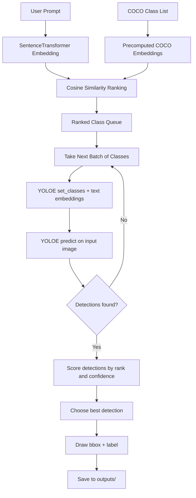

# YOLOE Prompt-Guided Detection

Prompt-driven object detection with semantic class ranking, batched re-parameterization, and early-exit inference.

## What This Project Does

- Uses SentenceTransformers to rank COCO classes by similarity to a natural-language prompt.
- Sends top-ranked classes to YOLOE in batches.
- Runs inference after each batch.
- Stops early as soon as a valid detection appears.
- Draws and saves annotated results to the `outputs/` folder.

## YOLOE Flow Diagram

## Repository Structure

- `YOLOE/YOLOEmain.py`: Main script flow.
- `YOLOE/YOLOEmaintestbench.py`: Benchmark-style run with timing and resource logs.
- `YOLOE/YOLOEmain.ipynb`: Notebook version for interactive testing.
- `YOLOE/images/`: Input images.
- `YOLOE/outputs/`: Saved detection results.

## Runtime Behavior

1. Prompt text is embedded once per query.
2. COCO classes are ranked by semantic similarity.
3. Classes are evaluated in batches (default 10).
4. Each batch triggers one YOLOE re-parameterization and one inference pass.
5. On first non-empty detection batch, the pipeline exits early.
6. Best detection is rendered and saved.

## Notes for Git

Model and large generated assets are excluded in `.gitignore` (for example: `*.pt`, `*.onnx`, `*.ts`).

## Troubleshooting

- Missing model file: ensure `yoloe-26n-seg.pt` is present in `YOLOE/`.
- Missing image file: ensure test images are in `YOLOE/images/`.
- Text model runtime error (`PytorchStreamReader...`): clear bad cached `.ts` assets and rerun.